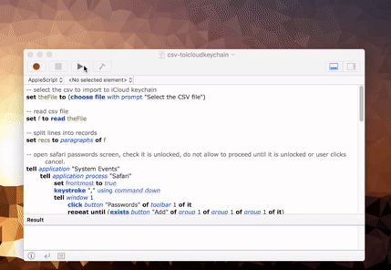
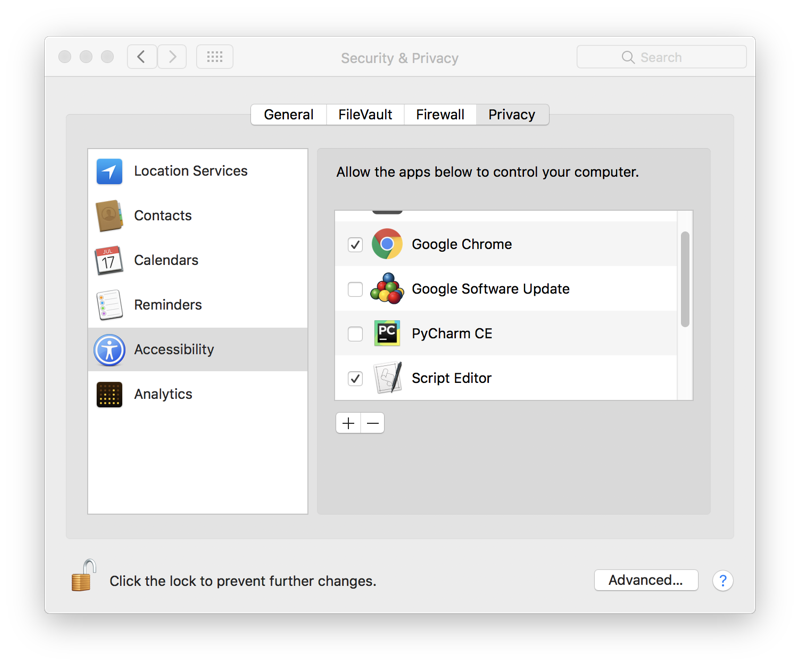

# csv-toicloudkeychain
AppleScript that will read a CSV file containing URL, username and password data and import this to iCloud KeyChain via Safari.

## CSV Layout
Create a CSV without headers with data in the below order.
>url,username,password

For example, import an entry for the user doggo at woof.org.
>woof.org,doggo,secretbonepass

## Accessibility Permissions
Script editor must be given permission under System Preferences - Security & Privacy - Accessibility to run. Ensure you remove this after you have finished running the script.

