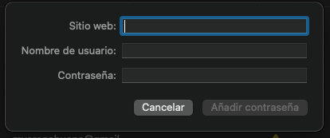

# csv-toicloudkeychain
AppleScript that will read a CSV file containing URL, username and password data and import this to iCloud KeyChain via Safari.

## CSV Layout
Create a CSV without headers with data in the below order.
>url,username,password

For example, import an entry for the user doggo at woof.org.
>woof.org,doggo,secretbonepass

## Accessibility Permissions
Script editor must be given permission under System Preferences - Security & Privacy - Accessibility to run. Ensure you remove this after you have finished running the script.

## Additional Considerations
Make sure to read the comments in the AppleScript file, specially:

- Make sure you include the strings to be looked for on the same language as your machine _(Change 'String' to your language equivalent! X/4_ comments)

- Include enough delays to allow you to stop the script execution when a repeated password is detected (the OK button will NOT be enabled).

- All the imported passwords MUST NOT BE already in the iCloud Keychain

- The fields to write the password details are empty (and with the focus on the first one, see next screenshot) BEFORE running the script! (Because maybe you need to stop it to fix some CSV line, make sure the fields are set as in the screenshot and that the dialog is closed BEFORE running the script)

- All CSV lines END WITH a domain: Safari does NOT accept password sites like "example", but only "example.com", careful when migrating from third-party apps.

The process is a little bit slow and manual (it took me about an hour to import ~200 items), but as far as I know there isn't better choice.